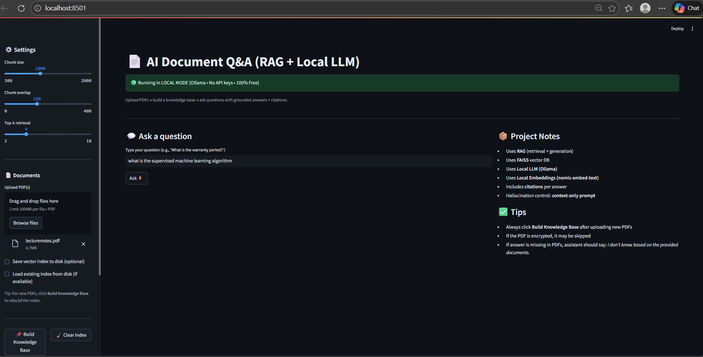
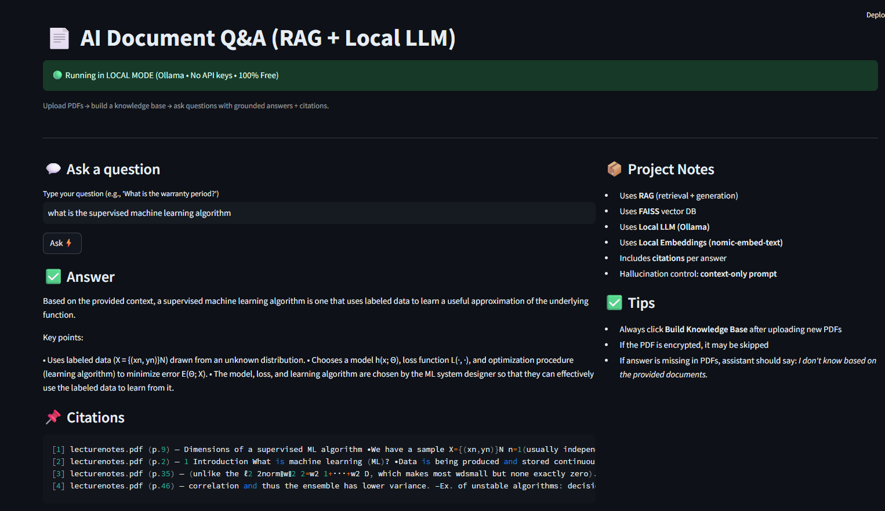

# 📄 AI Document Question Answering System (RAG)

A **local, production-style Retrieval-Augmented Generation (RAG) application** that allows users to upload PDFs and ask questions grounded strictly in document content.  
The system runs **fully offline** using a local LLM via **Ollama** — no external APIs, no API keys.

---

## 🚀 Key Features

- 📂 Upload one or multiple PDF documents  
- 🔎 Semantic search using **FAISS vector database**  
- 🧠 Local LLM inference using **Ollama (llama3.2)**  
- 🧾 Source-grounded answers with **file & page citations**  
- 🛡️ Hallucination control via **context-only prompting**  
- ⚡ Fast, interactive **Streamlit UI**  
- 💯 **100% free & local** — no OpenAI / cloud dependency  

---

## 🧠 How It Works (RAG Pipeline)

1. **Document Ingestion**  
   Uploaded PDFs are parsed and converted into text documents.

2. **Chunking & Embeddings**  
   Documents are split into overlapping chunks and embedded using a local embedding model.

3. **Vector Storage**  
   Embeddings are stored in a **FAISS** vector database for fast similarity search.

4. **Retrieval**  
   Relevant chunks are retrieved using semantic similarity (MMR-based retrieval).

5. **Generation**  
   A local LLM generates answers **only from retrieved context**, preventing hallucinations.

---

## 🛠️ Tech Stack

| Component | Technology |
|--------|-----------|
| Language | Python |
| UI | Streamlit |
| LLM | Ollama (llama3.2) |
| Embeddings | nomic-embed-text |
| Vector DB | FAISS |
| Framework | LangChain |

---

## 🖥️ Running the Project Locally 

### 1️⃣ Prerequisites
- Python 3.10+
- Ollama installed and running

## 🧠 Local Model Setup (Ollama)
### setup_environment:
 ### title: "⚙️ Setup Environment"
 ### description: "Create and activate a virtual environment"
  steps:
  
    - python -m venv venv
    
    - source venv/Scripts/activate   # Windows (Git Bash)
    
    - pip install -r requirements.txt

## ▶️ Run the Application
### python -m streamlit run app.py
#### Open in your browser:
#### http://localhost:8501

## 📌 Example Use Cases

- Insurance policy question answering
- Product manuals and documentation
- Resume and profile analysis
- Company policies and internal reports
- Private document analysis (offline & secure)

## 🔐 Security & Privacy

- No API keys required
- No data leaves your local machine
- PDFs processed entirely offline
- Suitable for confidential and sensitive documents

## 📈 Why This Project Matters

- Demonstrates real-world GenAI system design
- Uses industry-standard RAG architecture
- Shows hands-on experience with local LLMs
- Avoids “toy project” patterns
- Designed with production and interviews in mind

## 🔮 Future Enhancements

- Multi-knowledge-base support
- Chat history and conversational memory
- Re-ranking using cross-encoders
- Optional cloud deployment
- Role-based document access

## 👤 Author

**Avdhut Shinde**  
AI / ML Enthusiast  

🔗 GitHub: https://github.com/Avdhut30

---

⭐ If you find this project useful, feel free to star the repository.

## 📸 Project Output

